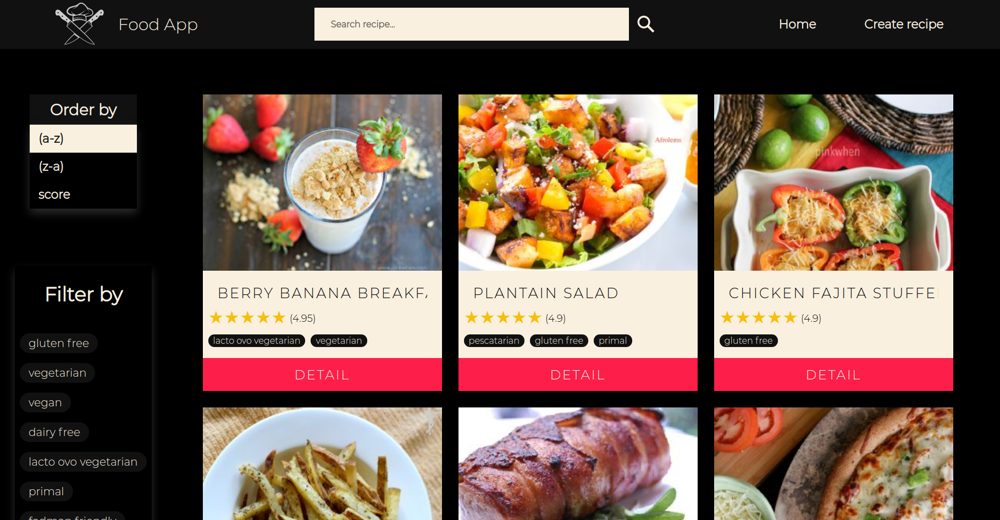

## Hi there 👋

I am __Julian Alvarez Windey__, a __Full Stack Developer__ from Argentina 🇦🇷. I am currently doing a licenciate's degree in __Math__ at UBA university. I enjoy solving problems and learning new things every day 📚. I am an easy going person, and very detail-oriented when it comes to working in projects 🧐. I think it's important always trying to get every detail right, and I constantly aim to achieve the most flawless possible results ⚡.

## 🛠️ Tech tools

- JavaScript
- Solidity
- HTML
- CSS
- React
- Redux
- Node
- Express
- Sequelize
- PostgreSQL
- Web3

## :bulb: Recent projects

### [Crypto Wallet App](https://vimeo.com/673809018)

### [Food App](https://jralvarezwindey-food-app.vercel.app)

## 📫 Contact

 &nbsp;&nbsp;
 &nbsp;&nbsp;

